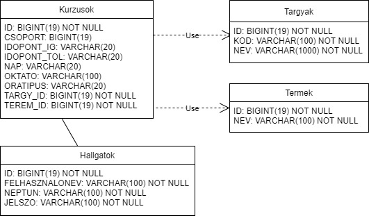

# Tanrend

A programban a hallgatóknak órarend összeállítására van lehetőségük. 

## 1. Követelményanalízis

Funkcionális követelmények:
  

Szerepkörök:  
>admin:  
>>hallgatók adatainak módosítása (törlés, hozzáadás, stb.)  
>>hallgatók órarendjének módosítása

>hallgató:  
>>órarend tervezése (kurzusok felvétele, törlése)  

## 2. Adatbázisterv

